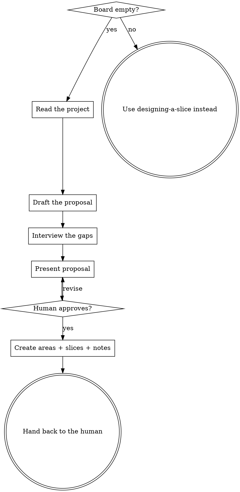

# Adopting a Project

Every other skill here assumes the board already has shape. This one is what
happens before that is true: an empty workspace, and a project that has been
running for months without it.

The goal is not to move the past onto the board. It is to end with a board that
tells the truth about **right now**, so the next session has something real to
read.

Vocabulary and stages: `~/.gemini/config/plugins/tuckit/content/domain.md`.

<HARD-GATE>
Do NOT create any area or slice until you have shown the human the full proposal
and they have approved it. This is not politeness. **tuckit exposes no delete
tool** — you can create an area but you cannot remove one. Everything you make
without asking, a human has to clean up by hand in the web UI.
</HARD-GATE>

## Stop if the board is already adopted

`get_project_state` and `list_areas` first. If there is even one area, adoption
has happened. Say so, and use `designing-a-slice` for whatever the human
actually wants. Do not "top up" a board that someone is already using — you do
not know which absences were decisions.

Re-running after a partial adoption is fine: match areas by name and skip the
ones that exist.

## Checklist

You MUST create a task for each of these and complete them in order:

1. **Confirm the board is empty** — `get_project_state`, `list_areas`
2. **Read the project** — structure, recent commits, branches, open PRs
3. **Draft a proposal before asking anything** — areas and in-flight slices
4. **Interview** — only questions the repo cannot answer
5. **Present the proposal once** — two blocks, get approval
6. **Create** — areas, then slices, then notes
7. **Hand back** — the human reads the board, then `designing-a-slice`

## 1. Two kinds of evidence, two different outputs

Read the repo before you ask a single question, and keep the two streams apart:

| What you read | What it is evidence for |
|---|---|
| Directory structure, commits from the last ~2 weeks | **Areas** — the standing concerns someone already works on |
| Current branch and its unmerged commits, open PRs, uncommitted changes | **Slices** — work that is in flight *right now* |
| TODO/FIXME comments, issue backlogs, "someday" notes | **Nothing.** Do not create anything from these. |

A branch is not a guess about what someone might do — it is somebody doing it.
That is why branches become slices and TODO comments do not. A backlog import
costs the human an afternoon of review on day one and pays them back never; if
they want those items, they can capture them later in seconds.

If the repo has no VCS history to read, skip to the interview and build the
proposal entirely from the human's answers.

## 2. What an Area actually is

**An area is a unit somebody can say "that one's mine" about.**

Not a directory. Not a language. Not a layer. A repo shows you what code exists;
it cannot show you who owns it. A `frontend/` directory can belong to a
contractor, to the same person who wrote the backend, or to nobody. That is why
step 4 exists.

<HARD-GATE>
Do NOT carry a list of project archetypes in your head and match against it.
There is no "typical setup" — not backend/frontend/infra, not
client/server/ops. Solo maintainers, research groups, game teams, firmware
teams, agencies, and one-person libraries all organise around things that list
does not contain. Derive the cut from this project's evidence and this human's
answers, every time. A vendor-authored structure is exactly the wall this
product exists to remove.
</HARD-GATE>

**Bias low.** One area is a legitimate answer, and a common one. Moving slices
between areas later is a single `update_slice` call; a board littered with empty
areas is a first impression you cannot take back. When the evidence is
ambiguous, merge rather than split. When it is ambiguous and the human is
unsure, create one area named after the project and let the split happen when
someone feels the need.

Ceiling: **at most 3 areas and 5 slices**, whatever the project's size. If you
found more candidates, pick the strongest and *say which ones you dropped* — a
silent truncation reads as "I covered everything."

## 3. Draft first, then interview

Do the inference before the conversation, so the human is correcting a draft
rather than writing one from a blank page. People are far faster and more
accurate at fixing someone else's wrong answer than at composing their own.

This is also the honest version of "give me a starter template and let me
customise it": the draft comes from *their* repo, not from a template someone
wrote for an imaginary company.

## 4. Which questions earn a place

**Ask a question only if two different answers produce two different boards.**
If you cannot name both boards, the question is small talk — skip it.

Qualifies:

> "I see `terraform/` and `.github/workflows/`. Is there someone whose job that
> is, or does whoever ships a feature handle it?"

— "someone's job" creates an Infra area; "whoever ships" does not.

> "This repo looks like the backend. Is there a frontend, and is it a different
> person's responsibility?"

— separate person creates a second area; same person does not, and a frontend
in a different repo may not belong on this board at all.

Does not qualify: "how do you test?", "what's your release cadence?", "how big
is the team?" — interesting, but no answer changes what gets created.

Rules for the interview:

- One question at a time. Show the evidence behind it.
- Prefer a choice over an essay. The human is at minute zero with nothing
  invested yet; this is the least patience they will ever have.
- Budget three to five questions. If you want more, you are designing, not
  adopting.
- **Every answer must be traceable to something you create** — or you say out
  loud that it did not change the proposal and record it as a note instead.
  Asking and then ignoring is the fastest way to lose someone's trust.

## 5. Present once, in two blocks

Show **areas** and **in-flight slices** separately — they come from different
places (the interview vs. the branches) and the human may want to accept one and
reject the other. Every proposed item names its evidence:

> **Slice** — "Checkout redesign"
> from branch `feat/checkout-redesign`, 12 commits since `main`, open PR #34

Then one approval for the whole thing.

## 6. Creating: what goes where

- `create_area(name, description)` — description says what falls inside it, in
  the human's words from the interview, not yours.
- `create_slice(title, area_id=…)` with **`spec` left empty**.
- `add_note(...)` on each slice with the evidence: branch name, PR link, what
  the commits touched.
- Pass `external_key` on every slice (the PR URL, or `adopt:<branch>`) so a
  re-run updates instead of duplicating.

**Never synthesise a spec from commit messages.** An empty spec reads back as
stage `needs_design`, which is the board saying *nobody has written down what
this is for* — and for a branch someone started without recording their intent,
that is precisely true. Undesigned work that looks designed is worse than an
empty field, because the next agent trusts it.

Yes, this means a branch that is 80% implemented shows up as `needs_design`.
That is the correct reading, not a defect. tuckit does not know the intent
because nobody wrote it down. Say this to the human when you hand back, so they
read it as a finding rather than a bug.

Observations go in notes; design goes in specs. Keep the line clean.

## 7. When nothing is in flight

A quiet repo — no branches, no open PRs, a clean tree — yields zero slice
candidates. Do not invent some. Create the areas, then ask one question:

> "Nothing's in flight in the repo right now. What are you actually working on
> next?"

Turn the answer into one slice, empty spec, filed into the area it belongs to.
One real slice beats five inferred ones.

## 8. Hand back

Do NOT chain into another skill on your own. The human has just been handed a
board they have never seen; they need to look at it.

> "Board's set up: <n> areas, <n> slices. Have a look — the specs are empty on
> purpose, so everything reads as `needs_design`. Want to start with <the
> top one>?"

If they say yes, that is `designing-a-slice`.

---

Original to tuckit-plugins. Unlike the pipeline skills, this one has no stage —
it runs at the one moment when there is no board for a stage to live on.
