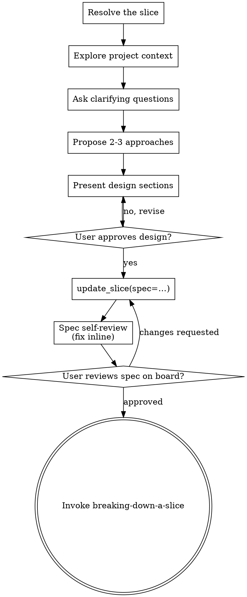

# Designing a Slice

Help turn ideas into fully formed designs through natural collaborative
dialogue.

Start by resolving which slice this is and understanding the current project
context, then ask questions one at a time to refine the idea. Once you
understand what you're building, present the design and get user approval.

The dialogue is the one you would have anyway; what changes is where it lands —
the slice's `spec`, not a file under `docs/`. A file is read by whoever knows to
look for it. A spec is read by anyone who opens the board, and by every agent
that reads the slice before touching the code.

Vocabulary and stages: `~/.gemini/config/plugins/tuckit/content/domain.md`.

<HARD-GATE>
Do NOT invoke any implementation skill, write any code, scaffold any project, or
take any implementation action until you have presented a design and the user
has approved it. This applies to EVERY project regardless of perceived
simplicity.
</HARD-GATE>

## Anti-Pattern: "This Is Too Simple To Need A Design"

Every project goes through this process. A todo list, a single-function utility,
a config change — all of them. "Simple" projects are where unexamined
assumptions cause the most wasted work. The design can be short (a few sentences
for truly simple projects), but you MUST present it and get approval.

## Checklist

You MUST create a task for each of these items and complete them in order:

1. **Resolve the slice** — find it on the board or create it, before the first
   question
2. **Explore project context** — project state, files, recent commits
3. **Ask clarifying questions** — one at a time, understand purpose /
   constraints / success criteria
4. **Propose 2-3 approaches** — with trade-offs and your recommendation, put
   onto the slice's canvas with `propose()`
5. **Present design** — in sections scaled to their complexity, get user
   approval after each section
6. **Write the design into the slice** — `update_slice(spec=…)`
7. **Spec self-review** — read it back and check for placeholders,
   contradictions, ambiguity, scope
8. **User reviews the spec on the board** — as it now renders, not as you
   described it in chat
9. **Transition to implementation** — invoke `breaking-down-a-slice`

## Process Flow



**The terminal state is invoking `breaking-down-a-slice`.** Do NOT invoke a
frontend-design skill, an MCP-builder skill, or any other implementation skill.
The ONLY skill you invoke after this one is `breaking-down-a-slice`.

## 1. Resolve the slice before you ask the first question

1. Search the board — the idea may already be captured, often months ago and
   better phrased than the request you just got. `list_slices(query=…)` searches
   the whole org; `list_slices(area_id='')` is the Inbox specifically. Look at
   both: unfiled captures are the easiest to miss and usually the oldest.
2. If a slice covers this, use it. Say which one, by ref.
3. If none does, `create_slice(title=…)` **now**, with an **empty spec**.
   - An empty spec is not laziness — it reads back as stage `needs_design`,
     which is the board saying *someone is designing this right now*.
   - Do not pre-fill the spec with the raw request. Undesigned work that looks
     designed is worse than an empty field.
   - File it into an area if it obviously belongs to one; otherwise leave the
     area empty and it waits in the Inbox. Both directions are reversible, so
     this is not a decision worth stalling on.

This is first because a design conversation that dies before step 6 leaves
nothing behind otherwise — and because work the board does not know about is
exactly what makes the board stale.

## 2. Understanding the idea

- Read project state from tuckit (`get_project_state`), then the code: the files
  this would touch, recent commits in that area, existing conventions. Check
  whether a neighbouring slice already owns part of this — overlapping designs
  are cheaper to find now than to merge later.
- Before asking detailed questions, assess scope: if the request describes
  multiple independent subsystems (e.g., "build a platform with chat, file
  storage, billing, and analytics"), flag this immediately. Don't spend
  questions refining details of a project that needs to be decomposed first.
- If the project is too large for a single spec, help the user decompose it into
  sibling slices: what are the independent pieces, how do they relate, what
  order should they be built? Then design the first one through the normal flow.
  Each sibling gets its own spec → steps → implementation cycle, and each spec
  names the others by ref.
- For appropriately-scoped work, ask questions one at a time to refine the idea
- Prefer multiple choice questions when possible, but open-ended is fine too
- Only one question per message — if a topic needs more exploration, break it
  into multiple questions
- Focus on understanding: purpose, constraints, success criteria

## 3. Exploring approaches

- Propose 2-3 different approaches with trade-offs
- Present options conversationally with your recommendation and reasoning
- Lead with your recommended option and explain why
- YAGNI ruthlessly — remove unnecessary features from every approach and design

**Put them on the canvas as you go.** Chat is a bad surface for judgement: the
options cannot be seen side by side, the branch you considered and dropped
scrolls away, and the person deciding is the most expensive resource in the
room. `propose()` writes the same options onto the slice's canvas, which they
watch grow in the browser.

```
propose(slice_id=<id>, nodes=[
  {"id": "q1", "parent": None, "kind": "question",
   "title": "Where does the draft live?"},
  {"id": "o1", "parent": "q1", "kind": "option", "title": "A JSON field on Slice",
   "summary": "one field, no new vocabulary",
   "body": "Costs a migration and nothing else...", "recommended": True},
  {"id": "o2", "parent": "q1", "kind": "option", "title": "A separate model",
   "summary": "queryable, but a fourth noun on the board",
   "body": "..."},
])
```

- `id` is yours and must be unique on that canvas; `parent` is another node's
  id, or `None` for the single root. Every option hangs off the question it
  answers.
- Call it **as each question comes up**, not once at the end. The point is that
  the human sees the tree grow while you are still thinking.
- It is append-only and accepted only while `spec` is empty. A branch that lost
  stays on the canvas — that is the record of what was considered.
- Keep talking in chat as well. The canvas is an addition, never the only way
  to answer you.

## 4. Presenting the design

- Once you believe you understand what you're building, present the design
- Scale each section to its complexity: a few sentences if straightforward, up
  to 200-300 words if nuanced
- Ask after each section whether it looks right so far
- Cover: architecture, components, data flow, error handling, testing
- Be ready to go back and clarify if something doesn't make sense
- Revise and re-present until the user approves — no silent redesign after a
  "yes"

**Design for isolation and clarity:**

- Break the system into smaller units that each have one clear purpose,
  communicate through well-defined interfaces, and can be understood and tested
  independently
- For each unit, you should be able to answer: what does it do, how do you use
  it, and what does it depend on?
- Can someone understand what a unit does without reading its internals? Can you
  change the internals without breaking consumers? If not, the boundaries need
  work.
- Smaller, well-bounded units are also easier for you to work with — you reason
  better about code you can hold in context at once, and your edits are more
  reliable when files are focused. When a file grows large, that's often a
  signal that it's doing too much.

**Working in existing codebases:**

- Explore the current structure before proposing changes. Follow existing
  patterns.
- Where existing code has problems that affect the work (e.g., a file that's
  grown too large, unclear boundaries, tangled responsibilities), include
  targeted improvements as part of the design — the way a good developer
  improves code they're working in.
- Don't propose unrelated refactoring. Stay focused on what serves the current
  goal.

## 5. Write the approved design into the slice

`update_slice(slice_id=…, spec=<the design>)`. Markdown; headings and tables
render.

**Writing the spec retires the canvas.** The draft and the spec are exclusive:
the moment a non-empty spec lands, the draft is cleared and the canvas switches
to rendering the spec's own heading structure. So carry the judgement across
**before** you write — the decisions you reached, which option won, and why the
others lost — usually as a decision table in the spec. Anything left only on
the canvas is gone.

- **`spec`** answers *what we are building and why*.
- **`constraints`** is a different field and a different reader: what a later
  agent must not get wrong — landmines, invariants, and what "done" actually
  means. If the design surfaced one of those, write it there, not buried in the
  spec's prose. `constraints` is what gets read by someone who will not read the
  whole design.
- Keep out anything that should not live in a tracker (credentials, endpoints
  with secrets in them).
- **One home.** If a repo convention wants a design file in git, make that file
  a pointer to the slice ref. A second copy of a design is a second thing to
  keep true, and it is always the one that goes stale.

## 6. Spec Self-Review

`get_slice(<ref>)` and read what actually rendered, with fresh eyes:

1. **Placeholder scan:** Any "TBD", "TODO", incomplete sections, or vague
   requirements? Fix them.
2. **Internal consistency:** Do any sections contradict each other? Does the
   architecture match the feature descriptions?
3. **Scope check:** Is this focused enough for a single implementation plan, or
   does it need decomposition into sibling slices?
4. **Ambiguity check:** Could any requirement be interpreted two different ways?
   If so, pick one and make it explicit.
5. **Constraint in disguise:** Is any of this prose really a landmine or a
   definition of done? Move it to `constraints`.

Fix any issues inline. No need to re-review — just fix and move on.

## 7. User Review Gate

After the self-review passes, ask the user to review the spec **as it now reads
on the board** — not as you described it in chat:

> "Design written to `<ref>`. Please review it on the board and let me know if
> you want to make any changes before we break it into steps."

Wait for the user's response. If they request changes, make them and re-run the
self-review. Only proceed once the user approves.

## 8. Implementation

- Invoke `breaking-down-a-slice` to turn the spec into steps on the board
- Do NOT invoke any other skill. `breaking-down-a-slice` is the next step.

## Resuming a half-finished design

A session that died mid-design left a slice at `needs_design` with whatever spec
it had. Pick that slice up at step 2. Do not create a second one for the same
idea.

---

Forked from superpowers (MIT, © 2025 Jesse Vincent) — `brainstorming`, rewritten
so the design lands on the board.
