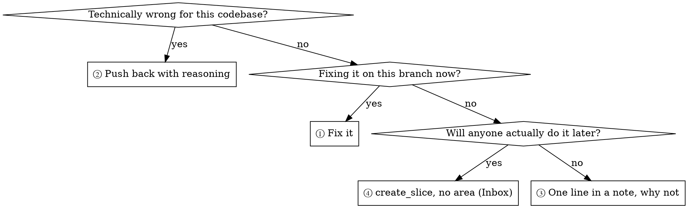

# Receiving a Review

## Overview

A review is a technical assessment, not a social event. Nothing here is about
managing the reviewer's feelings — theirs or yours.

**Core principle:** verify before you implement, ask before you assume,
technical accuracy over social comfort. And every finding lands somewhere: the
ones you are not fixing are the ones this skill exists for.

Vocabulary and stages: `__REPO__/plugins/antigravity/content/domain.md`.

**Announce at start:** "I'm using receiving-a-review to work through this
feedback."

## The response pattern

Six steps, per finding, in order:

1. **READ** — the whole review first. Do not start reacting to item 1 while
   items 4 and 5 are still unread; they may contradict it.
2. **UNDERSTAND** — restate the item in your own words, or ask. If you cannot
   restate it, you do not understand it yet.
3. **VERIFY** — check it against the code as it actually is. The reviewer read a
   diff; you can read the repository.
4. **EVALUATE** — is it technically correct *for this codebase*? A correct
   general principle can still be wrong here.
5. **RESPOND** — technical acknowledgement, or pushback with reasoning.
6. **ROUTE** — send it to one of the four destinations below.

## Forbidden responses

Never: "You're absolutely right!" · "Great point!" · "Excellent feedback!" ·
"Let me implement that now" before you have verified anything · **any expression
of gratitude**.

Instead: restate the requirement technically, ask a question, push back with
reasoning, or just start the work. One line of reason is enough — the behaviour
carries the message. The code is what shows you listened.

## Unclear items stop everything

If **any** item is unclear, implement **nothing** — not even the items you do
understand. Findings interlock: item 4 often changes what item 2 should look
like, and half-understood context produces confidently wrong work.

Items 1, 2, 3 and 6 clear, 4 and 5 unclear → do not start on 1, 2, 3 and 6. Ask
about 4 and 5 first, in one message, then work all six.

## Where the feedback came from

**A human partner** — trust the intent, but still ask when the scope is unclear.
"Fix the error handling" does not say how far.

**An external reviewer** (a subagent, a PR comment, a tool) — verify five things
before implementing:

1. Is it technically correct in this codebase?
2. Does it break existing behaviour?
3. Was there a reason the current implementation is the way it is?
4. Does it hold on every platform and version this project supports?
5. Did the reviewer have the full context, or only the diff?

When you cannot verify, say so rather than guessing: "I can't confirm this
without [X]. Do you want me to investigate, ask, or proceed as-is?"

## YAGNI check

When a finding says "implement this properly," grep for the callers first.

- Nothing calls it → "Nothing calls this endpoint. Delete it instead (YAGNI)?"
- Something calls it → implement it properly.

Building out a stub nobody uses is a finding you fixed by making the codebase
worse.

## Implementation order

Resolve every unclear item **first**. Then, in this order:

1. **Blocking** — breakage, security, data loss.
2. **Simple** — typos, imports, renames.
3. **Complex** — refactors, logic changes.

Test after each item and check for regressions. A batch of fixes tested once at
the end tells you something broke, not which one broke it.

## Pushing back

Pushing back is part of the job, not a failure of cooperation. Do it with
technical reasoning, never defensively:

- Be specific — quote the line, name the case.
- Bring evidence: a passing test, the calling code, the platform's docs.
- Ask a real question ("is this about the retry path, or the timeout?") instead
  of arguing about the abstraction.
- If the disagreement is architectural, bring your human partner in. That is not
  escalation, it is the right decision-maker.

If you notice yourself reluctant to disagree out loud, name that tension to your
partner and say it anyway. Agreement you did not mean is worse than friction.

## When your pushback was wrong

State it plainly and move on: "You're correct — I checked [X] and my initial
reading was wrong because [reason]. Fixing it now."

No extended apology, no justification of how you got there, no re-explaining the
whole system. One sentence, then the fix.

## Where each finding goes

Every finding enters here and leaves through exactly one of four destinations.



**Answering the three questions.**

- *Technically wrong for this codebase?* — you verified it and it does not hold
  here. Not "I would have done it differently." An item you could not verify is
  not wrong; it is unclear, and unclear items stop everything until you ask.
- *Fixing it on this branch now?* — **yes** when the finding is Critical or
  Important **and** sits in the change under review, or when it sits in that
  change and fixing it is smaller than writing it up. Otherwise **no** — either
  the code is outside this change and is not this branch's work however true the
  finding is, or it is inside and not worth reopening a reviewed change for.
  Either way it still needs one of the destinations below.
- *Will anyone actually do it later?* — would a named person or a next session
  pick this up off the board? Not "should someone" — *will* they.

Four rules govern the routing:

1. **No silent discard.** Every item takes one of the four. A `TODO` comment is
   not a destination, a line in your closing message is not a destination, and
   neither is the review report itself — it is a file nobody opens again.
2. **③ is batched into one note.** All of them in a single `add_note` on the
   slice. A note per finding drowns the activity thread, and a drowned thread
   gets skimmed.
3. **When the route is unclear, batch and ask once.** Collect every item you are
   unsure about and present them together. No per-item interruptions — asking is
   not a fifth destination, it just tells you which of the four to use.
4. **What the next person must not step on goes in `constraints`**
   (`update_slice`). Notes say what happened to you; constraints say what the
   next person must not repeat. If you hit the landmine yourself, write both.

**② writes nothing by itself.** When the ruling is one the next person could
re-raise — a design choice that looks wrong from outside, a trade-off you made
deliberately — it joins the ③ batch. Why we did not do a thing is worth as much
as what we deferred, and the next reviewer that reaches the same finding deserves
to meet the answer rather than repeat the round. A pushback nobody will revisit,
like a misread of a line the diff already answers, stays in your reply: writing
up every one of them drowns the note that makes the rest findable.

The question that separates ③ from ④ is **"will anyone actually do it"** — not
severity. A genuinely Important finding nobody will ever pick up is a note; a
trivial one the next person fixes in five minutes is a slice. Filing everything
as a slice fails the same way as filing nothing: an Inbox full of items nobody
reads stops being read at all.

### When there is no slice

An `ad-hoc` review or a PR comment can arrive with no slice behind it. The
routes still hold:

- **④ works unchanged.** `create_slice` with no area needs no parent slice —
  that is what the Inbox is. Name the repo and the PR in the body, because there
  is no slice context for it to inherit.
- **③ has nowhere to land**, since a note needs a slice to sit on. Promote the
  item to ④, or put the batch to your human partner and let them say which are
  worth a slice. Do not drop it because the convenient destination is missing.

① and ④ are unaffected, and ② is still delivered to whoever raised it. The one
part of ② that needs a home — a ruling worth recording, which would have joined
the ③ batch — travels with ③ above: promoted to a slice, or put to your human
partner. The absence of a slice narrows the routes to three; it never adds a way
out.

## Common Mistakes

| Mistake | Fix |
|---|---|
| Performative agreement | State the requirement, or just do it |
| Implementing before verifying | Check the codebase first |
| Batching the fixes, testing at the end | One at a time, tested per item |
| Assuming the reviewer is right | Verify whether it breaks something |
| Avoiding pushback | Technical accuracy over comfort |
| Implementing the clear half | Clarify every item before starting any |
| Proceeding when you could not verify | State the limit, ask for direction |
| Ending a finding with "I'll look at that later" | Not a destination. ③ or ④ |
| Ten findings, so all ten become slices | Split them on "will anyone do it." An Inbox full of noise is one nobody reads |
| A finding that only appears in your closing message | The board cannot see your closing message |

## GitHub thread replies

Reply to an inline review comment **inside its thread**, not as a new top-level
PR comment:

```bash
gh api repos/{owner}/{repo}/pulls/{pr}/comments/{id}/replies \
  -f body="<your reply>"
```

A top-level comment answering a threaded question loses which line it was about.

---

Forked from superpowers (MIT, © 2025 Jesse Vincent) — `receiving-code-review`,
rewritten so a finding you are not fixing goes to the board instead of the chat
log.
