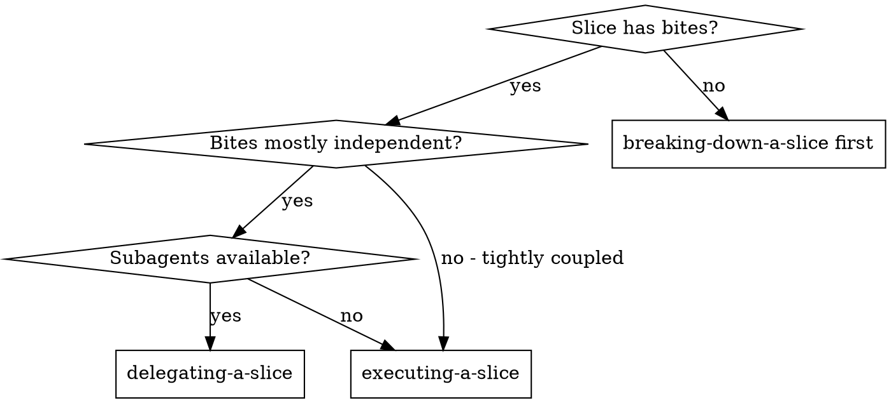
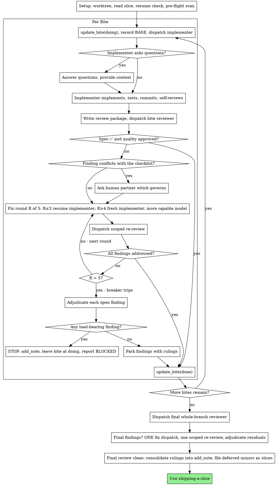

# Delegating a Slice

Execute a slice by dispatching a fresh implementer subagent per bite, a bite
review (spec compliance + code quality) after each, and a broad whole-branch
review at the end.

**Why subagents:** You delegate bites to specialized agents with isolated
context. By precisely crafting their instructions, you ensure they stay focused
and succeed. They never inherit your session's context or history — you
construct exactly what they need. This also preserves your own context for
coordination work.

**Core principle:** Fresh subagent per bite + bite review (spec + quality) +
broad final review = high quality, fast iteration

Vocabulary and stages: `${PLUGIN_ROOT}/content/domain.md`.

**Announce at start:** "I'm using delegating-a-slice to implement <ref>."

**Narration:** between tool calls, narrate at most one short line — the board
and the tool results carry the record.

**Continuous execution:** Do not pause to check in with your human partner
between bites. Execute the whole checklist without stopping. The only reasons to
stop are: a BLOCKED status you cannot resolve, ambiguity that genuinely prevents
progress, or every bite complete. "Should I continue?" prompts and progress
summaries waste their time — they asked you to execute the slice, so execute it.

## When to Use



**vs. executing inline:**
- Fresh subagent per bite (no context pollution)
- Review after each bite (spec compliance + code quality), broad review at the
  end
- Faster iteration (no human-in-loop between bites)
- Your context stays clean for coordination

## The Process



## Setup

Ensure the work happens in an isolated workspace: `git worktree add` a branch
off the base, following the repo's convention. **Never start implementation on a
main/master branch without your human partner's explicit consent.**

Read the slice once — `get_slice(<ref>)` — and note its `constraints`. Every
bite's requirements implicitly include that section, and you will hand it to
every reviewer. Create a todo per bite.

**Resuming.** Conversation memory does not survive compaction, so do not rely on
it to know where you are. The bite statuses are the record:

- `done` — finished, reviewed, committed. **Never re-dispatch it.** The commits
  it produced exist in git even when your context no longer remembers creating
  them; trust the board and `git log` over your own recollection.
- `doing` — a session died here. Resume this bite; read its slice's activity
  notes for why the last one stopped.
- `todo` — not started.

This is the single most expensive failure this loop can have: a controller that
lost its place and re-dispatched whole completed sequences. Reading status back
from the board removes it structurally, which is why bite status is updated
before and after each dispatch rather than in a batch at the end.

**Scratch directory.** Implementer reports and review packages are files, not
board writes. Set up one directory per slice:

```bash
ROOT="$(git rev-parse --show-toplevel)"
WORK="$ROOT/.tuckit/work/<REF>"
mkdir -p "$WORK"
printf '*\n' > "$ROOT/.tuckit/.gitignore"
```

The self-ignoring `.gitignore` keeps every slice's scratch out of `git status`
and out of accidental commits without modifying any tracked file. One directory
per slice ref, so a concurrent run of another slice can never read or overwrite
your artifacts. `git clean -fdx` will destroy it — recover from `git log` and
the board if that happens.

**Pre-flight scan.** Before dispatching the first bite, read the checklist once
for conflicts:

- bites that contradict each other or the slice's constraints
- anything a bite explicitly mandates that the review rubric treats as a defect
  (a test that asserts nothing, verbatim duplication of a logic block)

Present everything you find as **one batched question** — each finding beside
the bite text that mandates it, asking which governs — before execution begins,
not one interrupt per discovery mid-run. If the scan is clean, proceed without
comment. The review loop remains the net for conflicts that only emerge from
implementation.

## Model Selection

Use the least powerful model that can handle each role to conserve cost and
increase speed.

**Mechanical implementation bites** (isolated functions, clear bodies, 1-2
files): use a fast, cheap model. Most implementation bites are mechanical when
the body is well-specified.

**Integration and judgment bites** (multi-file coordination, pattern matching,
debugging): use a standard model.

**Architecture and design bites**: use the most capable available model. The
final whole-branch review is one of these — dispatch it on the most capable
available model, not the session default.

**Review tasks**: `requesting-a-review` owns this choice — follow its model
selection section.

**Fix-loop escalation (rounds 4-5)**: use a model at least one tier above the
implementer that got stuck.

**Always specify the model explicitly when dispatching a subagent.** An omitted
model inherits your session's model — often the most capable and most expensive
— which silently defeats this section.

**Turn count beats token price.** Wall-clock and context cost scale with how many
turns a subagent takes, and the cheapest models routinely take 2-3× the turns on
multi-step work — costing more overall. Use a mid-tier model as the floor for
reviewers and for implementers working from prose descriptions. When the bite
body contains the complete code to write, the implementation is transcription
plus testing: use the cheapest tier for that implementer. Single-file mechanical
fixes also take the cheapest tier.

**Bite complexity signals:**
- Touches 1-2 files with a complete body → cheap model
- Touches multiple files with integration concerns → standard model
- Requires design judgment or broad codebase understanding → most capable model

## The Bite Loop

Everything you paste into a dispatch prompt — and everything a subagent prints
back — stays resident in your context for the rest of the session and is re-read
on every later turn. Hand requirements over as board addresses and artifacts as
files.

### 1. Dispatch the implementer

`update_bite(bite_id=…, status="doing")` **first**, then record BASE
(`git rev-parse HEAD`) — the review package and fix-round diffs need it.

**Do not paste the bite body into the dispatch.** Give the subagent the slice
ref and its bite id and let it call `get_slice` and `list_bites` itself. The
board is the single source of requirements: a pasted copy costs your context,
can drift from what the board says, and buys nothing the subagent cannot fetch.

Your dispatch should contain: (1) one line on where this bite fits in the
project; (2) the slice ref and the bite id, introduced as "read these first —
they are your requirements, with the exact values to use verbatim"; (3)
interfaces and decisions from earlier bites that the board cannot know; (4) your
resolution of any ambiguity you noticed; (5) the report-file path and the report
contract.

- **Report file:** `$WORK/report-bite-<BITE_ID>.md`. Put the path in the
  dispatch. The implementer writes its full report there and returns only
  status, commits, a one-line test summary, and concerns.
- A dispatch prompt describes one bite, not the session's history. Do not paste
  accumulated prior-bite summaries ("state after bites 1-3") into later
  dispatches — a real session's dispatch hit 42k chars of which 99% was pasted
  history. A fresh subagent needs its bite, the interfaces it touches, and the
  slice's constraints. Nothing else.
- If an earlier bite parked a finding in the area this bite touches, carry a
  pointer to it in the dispatch.
- Record the implementer's agent identity from the dispatch result — fix-loop
  rounds 1-3 resume this agent.
- Never dispatch multiple implementation subagents in parallel (conflicts).

Template: [implementer-prompt.md](implementer-prompt.md)

### 2. Handle the report

Implementer subagents report one of four statuses:

**DONE:** Write the review package and dispatch the bite reviewer (step 3).

**DONE_WITH_CONCERNS:** The implementer completed the work but flagged doubts.
Read the concerns before proceeding. If they are about correctness or scope,
address them before review. If they are observations ("this file is getting
large"), note them and proceed to review.

**NEEDS_CONTEXT:** The implementer needs information that wasn't provided.
Provide the missing context and re-dispatch.

**BLOCKED:** The implementer cannot complete the bite. Assess the blocker:

1. If it's a context problem, provide more context and re-dispatch with the same
   model
2. If the bite requires more reasoning, re-dispatch with a more capable model
3. If the bite is too large, split it — `add_bites` for the pieces, and say so
4. If the checklist itself is wrong, escalate to the human

**Never** ignore an escalation or force the same model to retry without changes.
If the implementer said it's stuck, something needs to change.

If the implementer asks questions — before starting or mid-bite — answer clearly
and completely, provide additional context if needed, and don't rush it into
implementation.

### 3. Review the bite

Per-bite reviews are bite-scoped gates. The broad review happens once, at the
end. Never skip the bite review, and never accept a report missing either
verdict — spec compliance AND quality are both required. Implementer
self-review never replaces the bite review; both are needed.

Write the review package as `requesting-a-review` describes, using the BASE you
recorded before dispatching this bite — **never `HEAD~1`**, which silently drops
all but the last commit of a multi-commit bite.

- **Reviewer inputs:** the slice ref and bite id, the report file path, the diff
  file path, and the slice's `constraints` copied verbatim.
- The constraints block you hand the reviewer is its attention lens. Copy the
  binding requirements exactly: exact values, exact formats, and the stated
  relationships between components ("same layout as X", "matches Y"). The
  reviewer's template already carries the process rules (YAGNI, test hygiene,
  review method) — the constraints block is for what THIS project demands.
- Do not add open-ended directives like "check all uses" or "run race tests if
  useful" without a concrete, bite-specific reason.
- Do not ask a reviewer to re-run tests the implementer already ran on the same
  code — the implementer's report carries the test evidence.
- **Do not pre-judge findings for the reviewer.** Never instruct a reviewer to
  ignore or not flag a specific issue. If you believe a finding would be a false
  positive, let the reviewer raise it and adjudicate it in the review loop. If
  the prompt you are writing contains "do not flag," "don't treat X as a
  defect," "at most Minor," or "the checklist chose" — stop: you are pre-judging,
  usually to spare yourself a review loop.

The reviewer may report "⚠️ Cannot verify from diff" items — requirements that
live in unchanged code or span bites. These do not block the rest of the review,
but you must resolve each one yourself before marking the bite done: you hold
the slice and the cross-bite context the reviewer lacks. If you confirm an item
is a real gap, treat it as a failed spec review — it enters the fix loop with
the other findings.

Template: [reviewer-prompt.md](../requesting-a-review/reviewer-prompt.md) at
scope `bite` — `requesting-a-review` holds how to fill it.

### 4. The fix loop

Findings are routed by `receiving-a-review` — every one of them lands
somewhere. The rounds, the cap and the breaker below are this skill's: they
say *when* to use those routes inside the loop, not what the routes are.

The loop triggers when the review reports spec ❌, any Critical or Important
finding, or a ⚠️ item you confirmed as a real gap.

Before the loop starts, two routes leave it immediately:

- **Minor findings** never enter the loop. Record them in
  `$WORK/deferred-minors.md` as you go (`bite <ID>: <one-liner>`) and point the
  final whole-branch review at that list so it can triage which must be fixed
  before merge. A roll-up nobody reads is a silent discard.
- **A finding that conflicts with what a bite's body requires** is the human's
  decision, like any checklist contradiction: present the finding and the bite
  text, ask which governs. Do not dismiss the finding because the checklist
  mandates it, and do not dispatch a fix that contradicts the checklist without
  asking.

Everything else enters the loop. A fix round is one fix dispatch plus one scoped
re-review. **Five rounds maximum per bite.**

**Rounds 1-3 — resume the original implementer.** Send it the open findings
verbatim. Its context is intact: it knows the bite, the code, and its own
choices. If your harness cannot send another message to a live subagent,
dispatch a fresh implementer carrying the slice ref, the bite id, the
report-file path, and the findings — the report file is the persistent memory
either way.

**Rounds 4-5 — dispatch a fresh implementer on a more capable model** (per Model
Selection), with the slice ref, the bite id, the report-file path, the open
findings, and this framing: "A prior implementer attempted this bite [N] times;
you own it now. Read the report file for what was tried." A loop that survives
three resumes usually means the implementer cannot see its own problem — fresh
eyes and a capability bump in one move.

**Every round, either way:** the implementer fixes, re-runs the tests covering
the amended code, appends its fix report to the same report file, and returns
the short contract. Before re-dispatching the reviewer, confirm the fix report
contains the covering tests, the command run, and the output; dispatch the
re-review once all three are present. Name the covering test files in the fix
message — a one-line fix does not need the whole suite.

**The re-review is scoped.** Write a fresh review package over the fix range
(FIX_BASE = the head the previous review saw) and dispatch
[re-review-prompt.md](../requesting-a-review/re-review-prompt.md) at scope
`bite` — `requesting-a-review` holds how to fill it — with the findings list,
the slice ref and bite id, the report file, and the diff path. The re-reviewer
verdicts each finding ADDRESSED or NOT ADDRESSED and flags new breakage in the
fix diff only.
New Critical/Important breakage in the fix diff joins the open findings list.
Out-of-scope observations go to the deferred-minors list — they never extend the
loop.

**Never fix findings yourself in the controller session** — your context stays
clean for coordination, and controller fixes skip review.

**The breaker.** When round 5's re-review still leaves findings open, stop
dispatching. Adjudicate each open finding yourself — you hold the slice and the
cross-bite context the reviewer lacks. Write each ruling to
`$WORK/rulings.md`:

- **The reviewer is wrong, or the point is contestable:** park it —
  `bite <ID>: parked — <finding> — ruling: <why the code stands>`. The final
  review sees both sides.
- **Real, but nothing downstream builds on it:** park it the same way, with a
  ruling that says it's real and deferred.
- **Real and load-bearing** — a later bite builds on it, or it reveals a defect
  in the checklist: **STOP.** Leave the bite at `doing`, `add_note` on the slice
  with the finding, the bite text it collides with, and the fix history, and
  report to your human partner. Parking a structural failure lets every
  dependent bite build on it and hands the final review a problem it cannot fix
  either.

Adjudicate only at the cap. Adjudicating earlier to end a loop is pre-judging
with a different name. Every adjudication is a written ruling — a silent discard
is forbidden.

### 5. Complete the bite

When the review comes back clean — or every open finding is parked with a ruling
at the cap — `update_bite(bite_id=…, status="done")` and move on.

**Never move to the next bite while the review has open Critical/Important
issues that are neither fixed nor parked-with-ruling at the cap.**

If the bite turned out to be wrong rather than merely hard, fix the checklist
(`update_bite` the body, or `add_bites` for what it should have been) and say
so. Do not quietly implement something else; the board would then describe work
nobody did.

Anything discovered along the way that you are not doing now — a bug, an idea, a
follow-up — becomes a slice: `create_slice` with no area, so it lands in the
Inbox. Not a `TODO` comment, not a line in your closing message.

## Final Review

Use `requesting-a-review` with scope `branch`, and pass the deferred-minors
list as that scope's optional input so the reviewer can triage which of them
must be fixed before merge. Dispatch it on the most capable available model.

If the final review returns findings, dispatch **ONE** fix subagent with the
complete findings list — not one fixer per finding. Per-finding fixers each
rebuild context and re-run suites; a real session's final-review fix wave cost
more than all its bites combined. Then run exactly one scoped re-review of the
fix wave. Adjudicate any residual findings as in the breaker: park with rulings,
or stop on load-bearing ones. There is no second fix wave — residual
load-bearing findings surface to your human partner when `shipping-a-slice`
presents the options.

## Finish

When the final review is clean and its fixes are merged, three things cross from
the scratch directory to the board — and only these three:

1. **Rulings** — consolidate `$WORK/rulings.md` into **one** `add_note` on the
   slice. One note, not one per finding: a note per ruling drowns the activity
   thread.
2. **Deferred minors that survived triage** — `create_slice` with no area, one
   per surviving item. The ones the final review said don't block merge and
   nobody will do are dropped explicitly in the same note, not silently.
3. **Constraints you discovered** — append them to the slice's `constraints`.
   Notes say what happened to you; constraints say what the next person must not
   repeat.

Then delete the scratch directory (`rm -rf "$WORK"`) — git history and the board
are the record now. Sibling directories belong to other slices; leave them
alone.

Every bite is `done`, so the slice reads `ready_to_ship` on its own. Terminal
state: `shipping-a-slice`.

## Common Rationalizations

| Excuse | Reality |
|--------|---------|
| "Close enough on spec compliance" | Reviewer found spec gaps = not done. Fix, or hit the cap and adjudicate — those are the only exits. |
| "I'll fix it myself, dispatching is overhead" | Controller fixes pollute your context and skip review. Resume the implementer. |
| "One more round will converge" | Past the cap, rounds don't converge — the failure is structural. Adjudicate and route. |
| "The reviewer will just find something new anyway" | Scoped re-reviews verify fixes; they cannot wander. New findings on untouched code go to the deferred list, not the loop. |
| "This finding is obviously wrong, I'll drop it" | You adjudicate only at the cap, and every ruling is written down. Silent discards are forbidden. |
| "The fix was small, skip the re-review" | Unreviewed fixes are how regressions land. Every round ends with a scoped re-review. |
| "Reviews slow the loop down" | The loop without reviews is just unverified churn. Reviews are the loop's brakes and steering. |
| "I'll paste the bite body in — it's faster than making it call the board" | It is not faster; it is a second copy of the requirements living in your context, and it can disagree with the board. Send the ref and the id. |
| "I'll mark the bites done at the end, in one pass" | Then the board was a report, not a ledger — and the next session after a compaction cannot tell what you already dispatched. |
| "The scratch files are the record" | They are process. The record is bite status, the consolidated note, and git. Scratch gets deleted. |

## Example Workflow

```
You: I'm using delegating-a-slice to implement TP-42.

[Setup: worktree verified, get_slice(TP-42) read once, constraints noted]
[Resume check: bites 1-2 done, bite 3 todo — start at 3]
[Scratch: .tuckit/work/TP-42/ created]
[Pre-flight scan: clean, proceeding]

Bite 3 (id 88): Hook installation script

[update_bite(88, "doing"); BASE=a1b2c3d]
[Dispatch implementer: "read TP-42 and your bite id 88" + report path]

Implementer: "Before I begin - should the hook be installed at user or system level?"

You: "User level (~/.config/tuckit/hooks/)"

Implementer: [Later]
  - Implemented install-hook command
  - Added tests, 5/5 passing
  - Self-review: found I missed --force, added it
  - Committed

[Write review package a1b2c3d..d4e5f6a; dispatch reviewer with ref, bite id, paths]
Reviewer: Spec ✅ - all requirements met, nothing extra.
  Strengths: good coverage, clean. Issues: none. Quality: Approved.

[update_bite(88, "done")]

Bite 4 (id 89): Recovery modes

[update_bite(89, "doing"); BASE=d4e5f6a; dispatch implementer]

Implementer: [No questions] Added verify/repair modes, 8/8 passing, committed.

[Write review package; dispatch reviewer]
Reviewer: Spec ❌:
  - Missing: progress reporting (the bite says "report every 100 items")
  Issues (Important): magic number (100)

[Fix round 1: resume the implementer with both findings]
Implementer: Added progress reporting, extracted PROGRESS_INTERVAL.
  Re-ran test/recovery.test.js — 10/10 passing. Fix report appended.

[Scoped re-review over the fix range]
Re-reviewer: Missing progress reporting — ADDRESSED (src/recovery.js:41).
  Magic number — ADDRESSED (src/recovery.js:7). New breakage: none.

[update_bite(89, "done")]

...

[After every bite: final whole-branch review, most capable model]
Final reviewer: All requirements met. Deferred minors triaged: none block merge.

[add_note(TP-42, "<consolidated rulings + what was dropped and why>")]
[rm -rf .tuckit/work/TP-42]

Slice reads ready_to_ship. Using shipping-a-slice.
```

---

Forked from superpowers (MIT, © 2025 Jesse Vincent) —
`subagent-driven-development`, rewritten so the checklist and the progress
ledger are the board.
