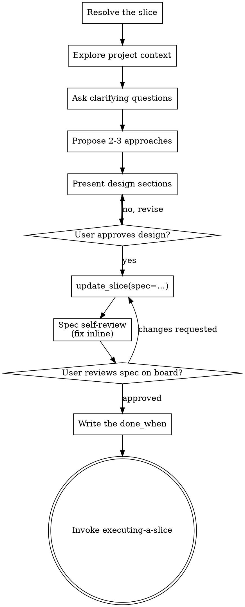

# Designing a Slice

Help turn ideas into fully formed designs through natural collaborative
dialogue.

Start by resolving which slice this is and understanding the current project
context, then ask questions one at a time to refine the idea. Once you
understand what you're building, present the design and get user approval.

The dialogue is the one you would have anyway; what changes is where it lands —
the slice's `spec`, not a file under `docs/`. A file is read by whoever knows to
look for it. A spec is read by anyone who opens the board, and by every agent
that reads the slice before touching the code.

Vocabulary and stages: `${PLUGIN_ROOT}/content/domain.md`.

<HARD-GATE>
Do NOT write code, scaffold a project, or invoke any implementation skill until
**the work exists on the board**, and — unless it is in the small lane defined
below — until you have presented a design and the user has approved it.

The board half has no exception. The design half has exactly one, and you take
it by naming it out loud, not by deciding privately that this one is obvious.
</HARD-GATE>

## Which lane this is in

Two lanes, and the split is whether there is a decision in the work.

**The small lane** — a typo, a version bump, a copy fix, a one-line change with
one obvious way to do it. Create the slice, write the one line of spec that
says what it is, do the work, and say which slice it was. That is the whole
ceremony, and running the checklist below on it would be theatre.

**Everything else — this skill.** If you can name a choice you would be making
on the reader's behalf, it is not in the small lane. Neither is anything where
you catch yourself writing "I'll just" or reaching for a second file.

Two things this split is not.

- It is not a size estimate. A four-line change that picks between two shapes
  of an interface is in the second lane; a two-hundred-line mechanical rename
  is in the first.
- **It is not a licence to skip the board.** Both lanes create a slice. What
  the small lane skips is the design, not the record — a change nobody can
  trace back to a reason is the failure this whole model exists to prevent,
  and it is much more common than an over-designed typo fix.

When you are unsure which lane you are in, you are in the second one. But say
which lane you picked, in one line, so a human can put you back.

## Checklist

You MUST create a task for each of these items and complete them in order:

1. **Resolve the slice** — find it on the board or create it, before the first
   question
2. **Explore project context** — project state, files, recent commits
3. **Ask clarifying questions** — one at a time, understand purpose /
   constraints / success criteria
4. **Propose 2-3 approaches** — with trade-offs and your recommendation,
   recording each decision as you reach it with `append_decision()`
5. **Present design** — in sections scaled to their complexity, get user
   approval after each section
6. **Write the design into the slice** — `update_slice(spec=…)`
7. **Spec self-review** — read it back and check for placeholders,
   contradictions, ambiguity, scope
8. **User reviews the spec on the board** — as it now renders, not as you
   described it in chat
9. **Write the done_when** — what would settle that this is finished
10. **Transition to implementation** — invoke `executing-a-slice`

## Process Flow



**The terminal state is invoking `executing-a-slice`.** Do NOT invoke a
frontend-design skill, an MCP-builder skill, or any other implementation skill.
The ONLY skill you invoke after this one is `executing-a-slice`.

## 1. Resolve the slice before you ask the first question

1. Search the board — the idea may already be captured, often months ago and
   better phrased than the request you just got. `list_slices(query=…)` searches
   the whole workspace; `list_slices(area_id='')` is the Inbox specifically. Look at
   both: unfiled captures are the easiest to miss and usually the oldest.
2. If a slice covers this, use it. Say which one, by ref and title — a bare
   ref makes your partner open the board to follow you.
3. If none does, `create_slice(title=…)` **now**, with an **empty spec**.
   - An empty spec is not laziness — it reads back as stage `needs_design`,
     which is the board saying *someone is designing this right now*.
   - Do not pre-fill the spec with the raw request. Undesigned work that looks
     designed is worse than an empty field.
   - File it into an area if it obviously belongs to one; otherwise leave the
     area empty and it waits in the Inbox. Filing is the board's way of saying
     someone means to do this, so it is a real judgement — but a reversible
     one in both directions, so do not stall on it here. Working through a
     whole Inbox is `filing-the-inbox`, not this skill.

This is first because a design conversation that dies before step 6 leaves
nothing behind otherwise — and because work the board does not know about is
exactly what makes the board stale.

## 2. Understanding the idea

- Read project state from tuckit (`get_project_state`), then the code: the files
  this would touch, recent commits in that area, existing conventions. Check
  whether a neighbouring slice already owns part of this — overlapping designs
  are cheaper to find now than to merge later.
- Before asking detailed questions, assess scope: if the request describes
  multiple independent subsystems (e.g., "build a platform with chat, file
  storage, billing, and analytics"), flag this immediately. Don't spend
  questions refining details of a project that needs to be decomposed first.
- If the project is too large for a single spec, help the user decompose it into
  sibling slices: what are the independent pieces, how do they relate, what
  order should they be built? Then design the first one through the normal flow.
  Each sibling gets its own spec → steps → implementation cycle, and each spec
  names the others by ref.
- For appropriately-scoped work, ask questions one at a time to refine the idea
- Prefer multiple choice questions when possible, but open-ended is fine too
- Only one question per message — if a topic needs more exploration, break it
  into multiple questions
- Focus on understanding: purpose, constraints, success criteria

## 3. Exploring approaches

- Propose 2-3 different approaches with trade-offs
- Present options conversationally with your recommendation and reasoning
- Lead with your recommended option and explain why
- YAGNI ruthlessly — remove unnecessary features from every approach and design

**Write each decision down as you reach it.** Chat is a bad surface for
judgement: the option you considered and dropped scrolls away, and the person
deciding is the most expensive resource in the room. `append_decision()` puts
it on the slice, where the next reader -- a person in six months, or the agent
that opens the slice before touching the code -- actually looks.

```
append_decision(slice_id=<id>, body="""
**Chose a text field on Slice.**

One field, no new vocabulary, and a migration is the whole cost.

Turned down: a separate model -- queryable, but a fourth noun on the board,
and nobody has asked to query it.

**Leans on** -- nobody needing to search decisions across slices. Two teams
asking for that and this is worth reopening.
""")
```

Four moves, and the fourth is the one people skip:

1. **What was chosen** — one sentence, in bold.
2. **Why** — what was true at the time that made it right.
3. **What was turned down, and why.** Without this the next person
   re-litigates the same options from scratch; it is most of the cost of
   reopening a decision.
4. **What it leans on** — the condition under which this stops being right.
   "Why" is the reasoning of the moment; this is when that reasoning expires.
   It is one sentence and it is what makes the record useful to somebody
   deciding again in a changed world.

- **Call it as each decision lands**, not once at the end. A record written
  afterwards is a summary; one written as you go is a record.
- **It is append-only and nothing seals it.** You cannot edit or delete an
  entry — correcting something means appending a new one that says so, which
  is the honest shape anyway. And unlike the design itself, it stays open
  after the spec is written and after the work ships: a direction that turned
  out wrong halfway through the implementation is exactly the entry nobody
  ever records, and it belongs here.
- **Say when your partner overrode your recommendation, and what they said.**
  That disagreement is the highest-signal thing in the whole record.
- The server stamps the date and who wrote it, so do not write those yourself.
  A decision you are relaying from your partner is stamped as yours, because a
  reader has to be able to tell an answer from a report of one.

## 4. Presenting the design

- Once you believe you understand what you're building, present the design
- Scale each section to its complexity: a few sentences if straightforward, up
  to 200-300 words if nuanced
- Ask after each section whether it looks right so far
- Cover: architecture, components, data flow, error handling, testing
- Be ready to go back and clarify if something doesn't make sense
- Revise and re-present until the user approves — no silent redesign after a
  "yes"

**Design for isolation and clarity:**

- Break the system into smaller units that each have one clear purpose,
  communicate through well-defined interfaces, and can be understood and tested
  independently
- For each unit, you should be able to answer: what does it do, how do you use
  it, and what does it depend on?
- Can someone understand what a unit does without reading its internals? Can you
  change the internals without breaking consumers? If not, the boundaries need
  work.
- Smaller, well-bounded units are also easier for you to work with — you reason
  better about code you can hold in context at once, and your edits are more
  reliable when files are focused. When a file grows large, that's often a
  signal that it's doing too much.

**Working in existing codebases:**

- Explore the current structure before proposing changes. Follow existing
  patterns.
- Where existing code has problems that affect the work (e.g., a file that's
  grown too large, unclear boundaries, tangled responsibilities), include
  targeted improvements as part of the design — the way a good developer
  improves code they're working in.
- Don't propose unrelated refactoring. Stay focused on what serves the current
  goal.

## 5. Write the approved design into the slice

`update_slice(slice_id=…, spec=<the design>)`. Markdown; headings and tables
render.

**Nothing seals when you write the spec.** The decision record and the spec
answer different questions -- how you got here, and where you arrived -- so
writing one never affects the other, and the record keeps accepting entries
for as long as the work does.

- **`spec`** answers *what we are building and why*.
- **`constraints`** is a different field and a different reader: what a later
  agent must not get wrong — landmines, invariants, and what "done" actually
  means. If the design surfaced one of those, write it there, not buried in the
  spec's prose. `constraints` is what gets read by someone who will not read the
  whole design.
- Keep out anything that should not live in a tracker (credentials, endpoints
  with secrets in them).
- **One home.** If a repo convention wants a design file in git, make that file
  a pointer to the slice ref. A second copy of a design is a second thing to
  keep true, and it is always the one that goes stale.

## 6. Spec Self-Review

`get_slice(<ref>)` and read what actually rendered, with fresh eyes:

1. **Placeholder scan:** Any "TBD", "TODO", incomplete sections, or vague
   requirements? Fix them.
2. **Internal consistency:** Do any sections contradict each other? Does the
   architecture match the feature descriptions?
3. **Scope check:** Is this focused enough for a single implementation plan, or
   does it need decomposition into sibling slices?
4. **Ambiguity check:** Could any requirement be interpreted two different ways?
   If so, pick one and make it explicit.
5. **Constraint in disguise:** Is any of this prose really a landmine or a
   definition of done? Move it to `constraints`.

Fix any issues inline. No need to re-review — just fix and move on.

## 7. User Review Gate

After the self-review passes, ask the user to review the spec **as it now reads
on the board** — not as you described it in chat:

> "Design written to `<ref>`. Please review it on the board and let me know if
> you want to make any changes before I write down what would settle it."

Wait for the user's response. If they request changes, make them and re-run the
self-review. Only proceed once the user approves.

## 8. Write the done_when

`update_slice(slice_id=…, done_when=<what would settle this>)`. This is what
moves the slice off `needs_done_when`, and it is the last thing you do before
any code exists.

**An observation, never a command.** `pytest -q` is a method: it says nothing
about whether the thing works, and it exits 0 for a suite that asserts
nothing. What belongs here is the sentence a method would have to produce:

```
An expired token returns HTTP 401, not a tool error inside a 200 --
that status code is the only thing that makes a client refresh.
```

```
Two shells, one with the modal open. After the other saves, the modal shows
the new title within 5s and no skeleton flashes; a stale save is refused
with a way to keep mine. pytest green does not show any of this.
```

Three things make one good, and they are all about the reader who runs it:

- **It can fail.** If you cannot describe the observation that would say "no",
  you have written a wish. "The code is cleaner" is a wish.
- **It names the surface.** Browser, terminal, production, a second process --
  this codebase has shipped bugs that every server-side test was green for.
- **It says what would NOT settle it**, when there is an obvious wrong answer
  waiting. Naming the trap is how the next reader avoids it.

Write it BEFORE the work. One written afterwards is a description of what you
did, which is the one thing it must not be — and it is the failure this whole
stage exists to prevent.

If the design surfaced landmines or invariants, those go in `constraints`
instead: different field, different reader. `constraints` is what somebody
must not get wrong; `done_when` is how anyone tells whether it is finished.

## 9. Implementation

- Invoke `executing-a-slice` to build it against that target
- Do NOT invoke any other skill. `executing-a-slice` is the next step.

## Resuming a half-finished design

A session that died mid-design left a slice at `needs_design` with whatever spec
it had. Pick that slice up at step 2. Do not create a second one for the same
idea.

---

Forked from superpowers (MIT, © 2025 Jesse Vincent) — `brainstorming`, rewritten
so the design lands on the board.
